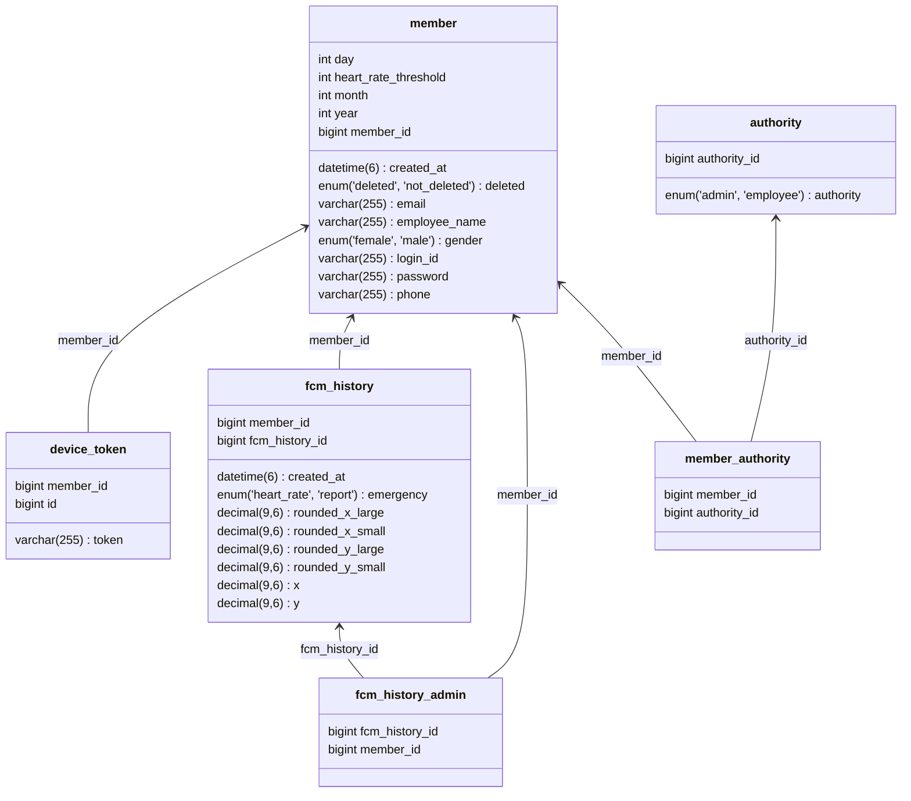

## AWS 배포된 서버

docs: https://cj-api.serial-blog.com/swagger-ui/index.html

</br>

## 백엔드 개발자 연락처입니다.
- 전화번호: 010-4474-5825
- 이메일: tmdwo5825@gmail.com

</br>

회원 로그인 관리자 계정입니다.
```
{
  "loginId": "asdf123456",
  "password": "asdf12345@",
}
```
</br>

## 본선 신기능 입니다.


- 하나의 정렬 API 에서 여러 정렬, 필터 조건을 받아 처리할 수 있습니다.
  - 정렬, 필터 쿼리를 동적으로 생성하여 처리합니다.
  - 동적 쿼리 생성에는 **QueryDsl**을 사용하였습니다.
- 이름으로 검색하는 API를 추가하였습니다.
  - 리포트 데이터에서 가장 최근의 데이터를 가져옵니다.
- 5초 마다 걸음 수를 받는 API를 추가하였습니다.
  - 모든 근로자의 걸음 수를 5초마다 받아오면 부하가 크기 때문에 MQ(Kafka)를 버퍼로 사용하여 배치 처리합니다.

</br>

## 심박수 AES256 암호화


</br>


</br>

## 로컬에서 시작 - Infra Docker setting
mac에서 가능합니다.

```text
brew install kcat
```
```text
cd ./infra/local
// 인프라 부분을 도커 컴포즈로 띄웁니다.
./start-up.sh

// 종료(인프라 부분을 종료합니다. 종료시 무조건 해당 커멘드로 종료해 주세요.)
./shutdown.sh
```

## Run API Module
Java version을 21로 세팅 후 실행해 주세요.

root project에서 실행해 주세요.
```
./build-image.sh
```
```text
./run-api-module.sh
```

## API Document
```
http://localhost:8080/swagger-ui/index.html
```

dev server용 yml파일은 숨김 처리 하였습니다.

local 서버에서 실행할 수 있게 application-local.yml 파일을 사용하실 수 있습니다.

</br>

## 시스템 구조


</br>

## 심박수 저장 nGrinder를 통한 테스트


**400명의 유저가 있다고 가정하고 심박수 저장**

</br>


**Kafka를 통해 심박수 정보를 버퍼에 두고 배치 처리하여 저장**

- 심박수를 정보를 하나씩 저장하는 것에 비하여 높은 처리량을 가질 수 있습니다.

---

</br>

# 신기능 - (심박수, 긴급)신고 시각화 기능

## 쿼리 최적화

프로시저
```sql
DELIMITER //

CREATE PROCEDURE InsertRandomData()
BEGIN
    DECLARE i INT DEFAULT 0;
    DECLARE x FLOAT;
    DECLARE y FLOAT;
    DECLARE random_date DATETIME;
    -- Generate a random date between 2024-07-15 and 2024-07-21

    WHILE i < 1000000 DO -- row 개수
        -- Generate a random date and time between 2024-07-15 00:00:00 and 2024-07-21 23:59:59
        SET random_date = DATE_ADD('2024-07-15 00:00:00', INTERVAL FLOOR(RAND() * 7) DAY);
        SET random_date = DATE_ADD(random_date, INTERVAL FLOOR(RAND() * 24) HOUR);
        SET random_date = DATE_ADD(random_date, INTERVAL FLOOR(RAND() * 60) MINUTE);
        SET random_date = DATE_ADD(random_date, INTERVAL FLOOR(RAND() * 60) SECOND);
        -- CJ 물류센터 용인시
        SET x = ROUND((RAND() * (37.183563 - 37.182010)) + 37.182010, 6); -- 랜덤 위도: 37.182010 ~ 37.183563
        SET y = ROUND((RAND() * (127.327854 - 127.326815)) + 127.326815, 6); -- 랜덤 경도: 127.326815 ~ 127.327854

        INSERT INTO fcm_history (x, y, created_at, member_id, emergency, rounded_x_small, rounded_y_small, rounded_x_large, rounded_y_large)
        VALUES (
            x,
            y,
            random_date,
            1,
            'REPORT',
            ROUND(x, 4),
            ROUND(y, 4),
            ROUND(x, 3),
            ROUND(y, 3)
        );

        SET i = i + 1;
    END WHILE;
END //

DELIMITER ;

CALL InsertRandomData();
```
</br>

### Slow Query 시간: 3 s

```sql
SELECT ROUND(AVG(x), 6) as x, ROUND(AVG(y), 6) as y, COUNT(*) as count
        FROM fcm_history
        WHERE created_at BETWEEN '2024-07-19 00:00:00' AND '2024-07-22 00:00:00' AND
        emergency = 'HEART_RATE'
        GROUP BY rounded_x_small, rounded_y_small
        ORDER BY count DESC
        LIMIT 1000;
```
</br>

### After Indexing

```sql
CREATE INDEX idx_created_at ON fcm_history (created_at);
CREATE INDEX idx_rounded_xy_small ON fcm_history (rounded_x_small, rounded_y_small);
CREATE INDEX idx_rounded_xy_large ON fcm_history (rounded_x_large, rounded_y_large);
```
</br>

### Using index 시간: 3000 ms → 1300 ms

```sql
SELECT ROUND(AVG(x), 6) as x, ROUND(AVG(y), 6) as y, COUNT(*) as count
        FROM fcm_history
        FORCE INDEX (idx_created_at, idx_rounded_xy_small)
        WHERE created_at BETWEEN '2024-07-19 00:00:00' AND '2024-07-22 00:00:00' AND
        emergency = 'HEART_RATE'
        GROUP BY rounded_x_small, rounded_y_small
        ORDER BY count DESC
        LIMIT 1000;
```
</br>

### Top-N 쿼리 최적화 1300 ms → 650 ms

```sql
DROP INDEX idx_rounded_xy_small ON fcm_history;
DROP INDEX idx_rounded_xy_large ON fcm_history;

SELECT ROUND(AVG(x), 6) as x, ROUND(AVG(y), 6) as y, COUNT(*) as count
        FROM fcm_history
        WHERE created_at BETWEEN '2024-07-15 00:00:00' AND '2024-07-22 00:00:00'
        AND emergency = 'HEART_RATE'
        GROUP BY rounded_x_small, rounded_y_small
        ORDER BY count DESC
        LIMIT 500;
```

1. **조기 종료 (Early termination):** RDER BY count DESC 와 LIMIT 500
을 함께 사용하면, MySQL은 모든 결과를 계산한 후 정렬하는 대신, 상위 500개의 결과만 유지하면서 정렬할 수 있습니다. 이는 "**Top-N 쿼리 최적화**"라고 불리는 기법입니다.
2. **메모리 사용 최적화:** 전체 결과 셋을 정렬하는 대신 상위 500개만 유지하므로, 메모리 사용량이 크게 줄어듭니다.
3. **인덱스 활용 가능성**: `count` 를 기준으로 정렬하면, MySQL 옵티마이저가 `COUNT(*)`를 효율적으로 계산할 수 있는 실행 계획을 선택할 가능성이 높아집니다.
4. **그룹화 최적화:** GROUP BY와 ORDER BY를 함께 사용하면, MySQL이 그룹화와 정렬을 동시에 수행할 수 있는 알고리즘을 수행할 수 있습니다. 
5. **필터링 효과:** `count`가 높은 그룹을 우선적으로 처리함으로써, 데이터의 대부분을 차지하는 주요 그룹을 빠르게 식별할 수 있습니다.

---
</br>

# ERD

